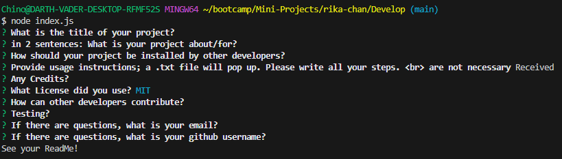
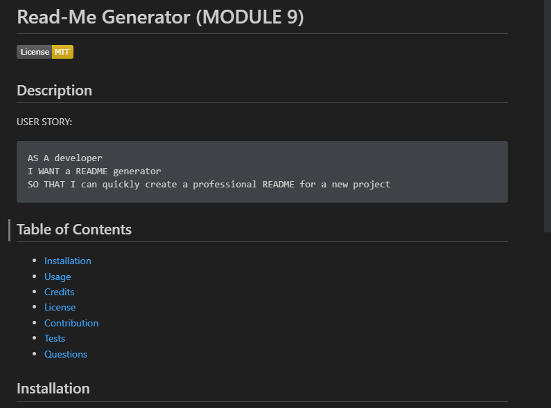

  # Read-Me Generator (MODULE 9)

  [](https://opensource.org/licenses/MIT)


  ## Description
  ```
  USER STORY:
  AS A developer
  I WANT a README generator
  SO THAT I can quickly create a professional README for a new project
  ```
  ### Prompts: 
  
  ### Generated ReadMe
  
  
  ## Table of Contents
  - [Installation](#installation)
  - [Usage](#usage)
  - [Credits](#credits)
  - [License](#license)
  - [Contribution](#how-to-contribute)
  - [Tests](#tests)
  - [Questions](#questions)
  
  ## Installation
  npm install inquirer@8.2.4
  
  ## Usage 
  ```
  ACCEPTANCE CRITERIA: 
  GIVEN a command-line application that accepts user input
WHEN I am prompted for information about my application repository
THEN a high-quality, professional README.md is generated with the title of my project and sections entitled Description, Table of Contents, Installation, Usage, License, Contributing, Tests, and Questions
WHEN I enter my project title
THEN this is displayed as the title of the README
WHEN I enter a description, installation instructions, usage information, contribution guidelines, and test instructions
THEN this information is added to the sections of the README entitled Description, Installation, Usage, Contributing, and Tests
WHEN I choose a license for my application from a list of options
THEN a badge for that license is added near the top of the README and a notice is added to the section of the README entitled License that explains which license the application is covered under
WHEN I enter my GitHub username
THEN this is added to the section of the README entitled Questions, with a link to my GitHub profile
WHEN I enter my email address
THEN this is added to the section of the README entitled Questions, with instructions on how to reach me with additional questions
WHEN I click on the links in the Table of Contents
THEN I am taken to the corresponding section of the README
  ```
  ### DEMO: 
 Video of application's demonstration: [ReadMe Geneator Demo](https://drive.google.com/file/d/14TMtnMRv3agJQGkVPHaVv334sqwMk9IV/view)
  
  ## Credits
  [ReadMe Template](https://coding-boot-camp.github.io/full-stack/github/professional-readme-guide)
  
  ## License
  This project uses the [MIT License](https://opensource.org/licenses/MIT) license
  
  ## How to Contribute
  Open Source Project. Feel free to make your own changes to it.
  
  ## Tests
  No Tests required
  
  ## Questions
  ### Github: https://github.com/chinosj89
  ### Email: raphael.sanjuan13@gmail.com
  
